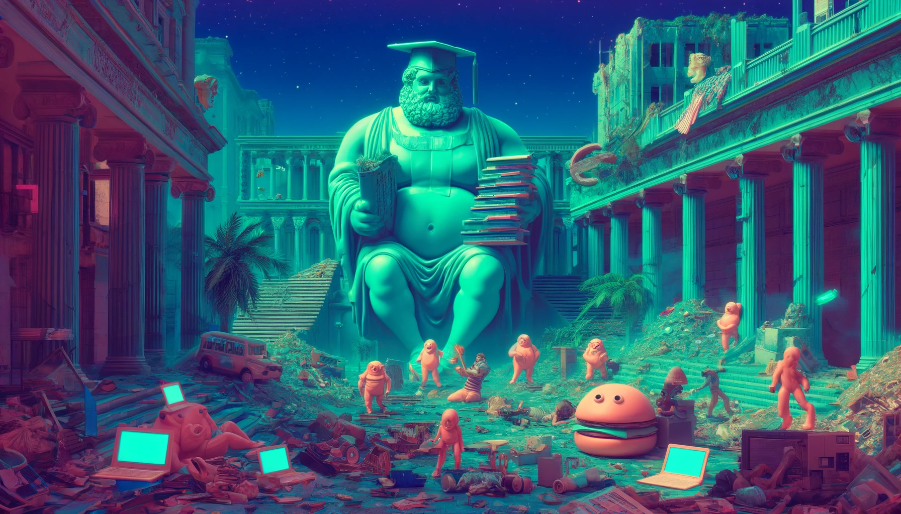

# From Moonshot To Madness

London, UK - April 2024

Author's note

This is the essay that started this project. I was working on Homebrew MVP and I was writing technical documentaion. I've never done that before so I asked chat gpt how to write it. I gave me some strucutre and the first paragrath was called "background". I wrote the docs and left the background for the end. Then I started writing explnation why I'm working on Homebrew. After one week of constant writing all day long and 5 essay later I still can't stop writing. Hopefully it's not all gibberish.

**Inspiration**

The original Homebrew Computer Club, started in March of 1975 by Steve Wozniak, Lee Felsenstein, and Fred Moore, revolutionised personal computing and forever changed the world we live in. Today, I seriously can't imagine a life without my MacBook, and as ridiculously as it might sound, I'm sure I would be a completely different person without it. Thanks to my MacBook I was able to learn: coding, design, writing essays, software project management, philosophy, typography, neural networks and many other things.

I never met my grandfather; he died before I was born. But if he could magically appear just for one day, back on Earth, and see me studying in London, reading about all these cool things in English, which isn't even my first language and I also learned it thanks to the magic of electronic circuits, transistors, and algorithms, he would be really amazed by this wonderful technology.

**Democratization**

However, we must remember that this technology might never have taken its current shape, and computers could as well have evolved into business-only devices, contributing to an increase in wealth disproportion and being a device for the chosen ones only. Capitalism is a beautifully efficient system, and the best that we've come up with so far, but it has its flaws. Capital and power concentration is one of those flaws. It usually works in cycles. Capital and power are concentrated, we all grow, amazing technology is created but often limited to a few and drastically overpriced, and then some revolution happens that democratizes precious technology, making the field more equal again. White bread, shoes, tableware, candles, radios, watches, or TVs were all reserved for the extremely rich in the past, and today in Western society, almost everyone can have them.

In a very high overview, it might seem like the system works great, and we should just sit and wait until the system will democratize more great things for us, but the devil is in the details. Democratization never happens on its own. It's an extremely hard process, done by real people, who dedicate decades of their lives, working unimaginably hard to finally "put a dent in the universe." I've seen that speech over 20 times by now, but I still remember when I first heard:

"Everything around you that you call life was made up by people who were no smarter than you, and you can change it, you can influence it, you can build your own things that other people can use."

I was probably around 16 years old when I first heard that, and since then, I've never looked at the world the same way. For over a decade of my chaotic and not very successful life, I've been very closely watching and analyzing things around me, looking for my path and looking for a thing that needs to be changed the most, and I today I know that education is that thing. Why? Because it's important and broken.

**Crisis in Education**

For the last 50 years, Academia has progressively gone from creating atomic bombs, putting people on the moon, and building supersonic jets to participating in some ridiculous Monty Python [sketch](https://www.youtube.com/watch?v=R79yYo2aOZs). And even if funny at the beginning, it’s not funny anymore when people lose jobs or public respect for saying the most simple truths or wearing certain haircuts. I believe that education is to be blamed for that. The process is perfectly described by Peter Thiel in his phenomenal [book](https://www.goodreads.com/en/book/show/276022) “The Diversity Myth.” My bet would be that people from the 22nd century will call this book one of the most important books of the 20th century.

[The new left](https://en.wikipedia.org/wiki/New_Left) in the 1960s figured out that communist revolutions organized by the proletariat don’t work most often because power is held by the elites, and they don’t want communism. So, they figured out that in order to make Marxism the mainstream ideology, they have to infiltrate the elites. And very smartly, slowly but steadily, they targeted and infiltrated the elite universities step by step. I think the outcome of their work is exponential, and after 70 years of slow propaganda and working in the shadows, over the last decade, they have become mainstream.

The problem with Marxism is that it is an ideology much closer to a religion than to science because its followers, for some reason, always lose the ability to think critically and base their thinking on facts. They do not acknowledge human nature, economic reality, and historical examples, always saying “this time it will work” almost like a casino player addicted to a one-armed bandit, but persuading us to gamble not with their own money but with our lives, despite a 100% rate of failure in the past.

Some of them say “it’s impractical but moral,” but it’s not moral at all. Even though I understand Marx’s concerns with the overexploitation of factory workers at his time, copy-pasting the same thinking patterns now is simply ridiculous. But I know it’s tempting. Marxism is a heroin for your soul. It makes you instantly happy without working for it by giving you a false sense of control over your life by its deceitful yet delightful ability to immediately kill the pain of meaningless by taking the burden of responsibility off your shoulders so now you can proudly call yourself “oppressed” instead of useless fat fuck. Being a revolutionist who fights for the equality with the evil capitalistic system of oppression sounds much better then being unemployed. (As an unemployed revolutionist I know what I’m talking about) Nothing can kill this pain of meaninglessness better than finger-pointing at people who worked harder than you and saying that all your problems are their fault. Nietzsche described it perfectly in Zarathustra in the [Tarantulas Chapter](http://4umi.com/nietzsche/zarathustra/29)

**The Consequences of Marxism**

As always, applied Marxism can only create chaos, destruction, and pain. The Western world is in one of the biggest crises in its history. The USA, from being the most glorious empire in the history of the world, turned into a shitshow, run by elites educated on (once glorious) universities following the Monty Python ideology of purely Marxist diversity, equity, and inclusion. Where your race, gender, and identity are the core topics of public debate, and people are not individuals anymore but rather some archetypical muppets, and we should judge people by how they look or identify, instead of on a meritocratic basis.

I’m not going to spend much time on it; it’s moronically stupid, makes no sense, we all know it. Here is the manifesto that tells you how to go against that. My main point after this extremely long introduction is this: for the last 50 years, Academia has been constantly decreasing quality (read about grade inflation and think about the usefulness of your degree) and increasing prices (much more rapidly than inflation) while constantly debating if a guy with fake tits is a real woman or not, and putting people in prison after saying he/she/they/Apache attack helicopter is/isn’t a real woman. And I have nothing against trans people, I’m a libertarian, our motto “live and let live” implies that I shouldn’t give a fuck about what adult people are doing, good for them, high five guys, I’m really glad that if it helped you feel more like yourself and made you feel happy. I simply don’t think that it’s the most important topic in the world and we should talk about it 24/7. Exactly the same about feminism, racism, sexism, and all x-isms in the world.

Absolute equality is simply impossible in a free society. In free societies, people are not equal, and in equal societies, people are not free. As Musk said, we should simply stop talking about this and focus on working on more important things instead of reminding everyone about the division and differences in society. Let’s forget about equity (forced equality) and simply focus on providing amazing opportunities for everyone in the world for free, and let the highest achievers win instead of stopping them to not make lowest achievers happy. And that is our mission, to build a global, free, open for everyone, 100% online, AI-powered university where everyone can start teaching and learning without any barriers, and the free market and scientific method will do the rest.
