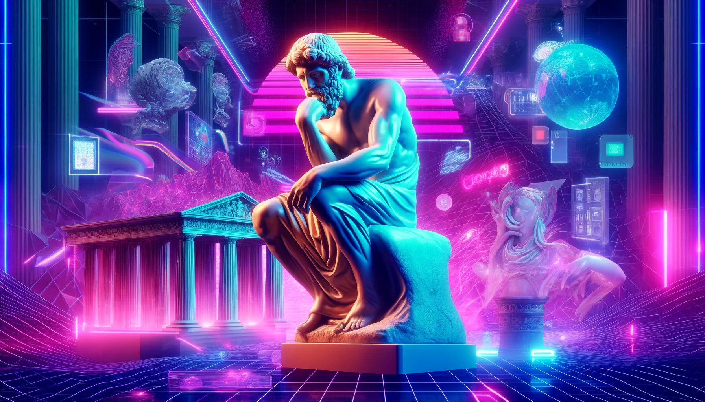
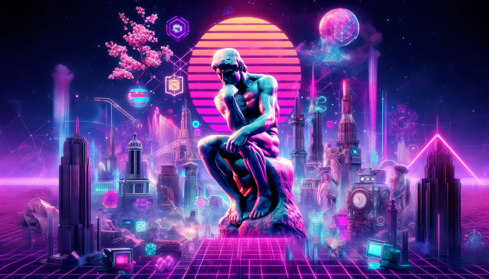

# Life Master Plan

London, UK - April 2024

## Intro

Writing helps me clear my head a lot. Often when I don't know how to do something it's because I don't know how to figure it out. It sounds trivial but it isn't. There is a very big difference between not knowing how to do something but knowing how to figure it out, and not knowing how to do something and not knowing how to figure it out. For example I don't know how to make pancakes by heart but I know how to figure it out, simple Google / ChatGTP search will solve the problem in few seconds. But I also don't know how to build rockets and I have no idea how to figure it out. Where do I start? Should I learn phyisics for that? If so on what level, online or at uni? Do I need to know programing as well? Which languages and on what level? There are hundrets questions per minute in my brain that make it impossible to move forvard. Very often that question storm in my brain paralises me from taking action. That's why I started writing essays, to channel the storm into somthinge productive. But I also figured out that a good way to move forward from that state is to write a tutorial for doing a thing you want to do and then simply follow it. It doesn't make much sense to do it for trivial things, but for a big one, like writing a life master plan it might work. So let's try to do it in this essay.

## How to write a life masterplan?

It's always a good practive to ask yourself before starting an essay or a project why even boder. It helps clarify the purpose. For this one it's simple. To survive.

Our spice is a very uniqe position, majority of us don't have to fight for survival anymore. When we do, we have a purpose - fight for survival. We don't have to think too much, we just have to fight. Our natural survial instinc works very well. However, thanks to our great civilisation progress we don't have to do that anymore, and our brains don't seem to be well adapted for that situation. We also have a free will, consciousness and self-awerness so the suiside becomes and option. It's not a secret that you can kill yourself pretty easily today, so everyone sooner or later will have to anwser the question do I want to do it? Our survival instict says "rather not" but just after that our rational part often asks "why not?". And it's not an irrational question.

If are given a choice and you have two options "to be or not to be" you have to choose one of them. You can ofcourse simply ignore that question for ever activly trying to think about something else, but it's also a choice. I think that might be a tactic that majority of poeple use, simply distract yourself from this frightening question. But when unanwserd this question will always come back to you, often in the most unexpected moments when you are the most vulnerable. Those blood-curdling moments happen in variaty of circomstanses, from sitting alone on the beach or at the top of the moutain watching sun slowly hiding behind the horizon, or looking at cristal clear sky late at night in the of nowhere hugged by the love of your life to smoking a cigarate alone at the balcony of the obscure motel when the sun is rising, whore is living and coke barly works anymore.

Our happines, hate, nor even horniness are able to distruct us from this essencial question, no matter how hard we try. Nor shuold they, it accutly would be a complete catastrohy if we woudn't feel that void called by grumpy Arthur - weltschmerz. I'm aware of only one substance that can completly silence weltschmerz while user is under the influce - Herion (or fentanyl, opioids in general. Few weeks ago I smoked a joint spiked with fentanyl, and omg this shit is hard, like hard hard, cocaine, mdma, amphetamie don't have even 5% intencity of opioids). If we magicly cured our existentinal pain our civilisation would extinct in few years.

Thre is no God but if he existed weltschmerz would be his most prsious gift for humanity. Why? Because unlimited, unconditional happines = stagnation and stagnation = decline which = death. Imagine being constanly happy regardless of your actions. I know people who are, they lay on the streets of once glorious San Fransico and I can guarantee you that they are in fact constantly happy, at least when they are under the influce of opioids. Sucking a dick of a dirty homless for a portion of a drug, no problem, they are really happy doing that because heroin really provides that amount of pure happines. Or imagine eating like shit for 10 years, not exercising and being at the same level of happines what persons which dedicated those 10 years to training and healthy living. What would be the puropse of exersising then?

So shuold we just accept weltschmerz, and follow the grumpy Arthur advice to live a life of an ascet, minimize our desires and look at some fucking paintings for the rest of our lives? You can if it seems apealing to you but I don't think a life resembling eternal waiting in a doctor's queue is an option for me. Schopenhauer had to explain somehow why after inhering a family fortune and living out of intrest for his whole life, he wasn't able to get a job and spent his entire life alone. While reading "The World as Will and Representation" we must remember that is was written in some small rented dresden flat by a guy who was just fired from university because students didn't want to attend his boring lectures, in pararel to jerking off thinking about Caroline Richter and writing about man superioirty. This is, btw, how most philosophers start their careers, you don't start writing essays all day long while swiming in pussy juice, trust me. Monumental ego mixed with constant life failures produce more energy then a nuclear power plant.

Weltschmerz is real and we all (hopefully) can feel it. It cause unbarbale pain and suffering for all of us. We established that distrucion doesn't work because it will get you anyway, the only know remedium (heroin) will destory your life and cause Weltschmerz squered when you get sober, minimalising suffering by ascetism and art works but it's embarrassing(and scars the hoes). So what choises do we have left? Stopping the weltschmerz imidietly, once and for good (suiside) or finding something that will heal it. Former most likely works but latter seams much more exciting. Almost all religions tried to solve that by guild tripping you and threding enternal torturs as a punishment (btw, very fucking sophistaced guys, if that's all your "all-wise" God was able to came up with, then send me straight to hell, prefereably to infero to philiopers secion, but other places will work as well. If you really, really want to properrly tortue me with the full posisble cruality send me streaight to Paradiso to sit between Abraham, Hiob and Nazists, biggest enstusiast of saint "Befehl ist Befehl" rule. If philosophy is a love of wisdom and it's a practice of asking hard question, then religion, a practice of not asking hard question is the love of what? Don't anwser if you want your God to remain alive, and enjoy the heroin for your soul. I know it feels good.)

I have a terrible tendency to writing lengthy intorduction to my tutorials. So how can we heal the weltschmerz? Simply by finding our life puropse and then fighting with the reality to make it a reality. How to find a purpose in life? You can take if from somwere else and adopt the "off the shelf" purpose of live or deeply analise the reality and create your own. To be honest I would much rather take off the shelf purpose of live but it just so happens that all of them are currently terribly stupid. It's very tempting thought, and I hope that in the future Cyberianism and Cible will provide you with a great purpose (or purposes to choose from) of life, or at least will give you excelent tools to find one fast and easy(ai based most likely). There are many institusion and idolodgies that provide you with that but it's often very costly and requires sacrificing your presious independence of thought. Religions, sub-culutres, cults, gramppy bitches and unwanted kids can often supply you with a life mission and will make sure that you will get your hand dirty. The toughest moments in life are when you realising your life master plan is not yours and years or even decades of your life are irriversibly lost. Saving some time early in life to move fast and quickly climbe on a random ladder just because everyone else climbs on some ledder and tells you that you must start climbing now, no metter where might not be an optimal solution even if it looks like everyone enjoys climbing. It's much better to cerfully choose the ladder before climbing and make sure that is the one.

So how to find a meaning of life? It was a question that kept me awake (and probablly most of us) for many sleeples nights. The best anwser I found is by [Elon](https://www.youtube.com/shorts/iqMPe3TgsJI) and it is to understand the nature of the universe better and figure out meaning of life. It sounds cool, but what if you are not Elon and don't want to start a rocket company? Then I think on the macro level it is simplly trying to be as useful to the society and the civilisation as possible. There is a very wired feature in our brain that makes use very happy and heal the weltschmerz when we are usefull. It doesn't have to be a big thing, it can be very small like starting a barber shop and serving your clinets well. Just make it a bit (or hopefully a lot) better then your predicesors, idk, learn how to talk well with customer by reading interesting books, serve free tea, whisky or bear desing the barbaer shop in a super orginal way to make it look like a futuristic barbershop from 2080 idk, just make something useful and make it better then anyone else. Learn about what intrests you to the point beyond obssesion, learn design to know how to make things better, learn your craft (anything useful from coding to cutting hair) and practive it religiously and contantly improve. On a micro level - the basic purpose of your existance is purlly evolutionary, find a good looking partner, enjoy fucking him/her, fell some oxytocin and call it love, and pass your genes further. Apparently it gives a lot of happines as well. Having a family is still in a backlog for me so I have no idea abuot it but I would assume that it must be cool, and esspecialy valuable at the latest stage of your live when all your friends will be dead or sitting at home shitthing themslevs and their last 3 working brain cells won't be enought to produce particulary interesting converstaion, then having a family, kids and grandkids sounds like fun.

## Life Master Plan Tutorial

### Step 1: Confront the Weltschmerz

- **Acknowledge the void**: Weltshertz is real, life by defulaut is an expenentionally painful torture.

- **Reject quick fixes**: Hedonism and focusing only of the persuit of pure pleasure in any form wont supress Weltshertz, when you sobber up, and eveentully you will have to Weltshertz will be squered.

- **Acknowledge the Weltshertz Purpose**: Understand that if you activly won't work on finding you purpose, being usefull and being happy your life will be extreamlly paintfull, long and boring.

### Step 2: Define Your Purpose

- **Evaluate existing options**: Explore most common ideologies, religions, and communities that offer pre-defined purposes. Realise they are all shit.

- **Consider the cost of conformity**: Think if the there is anything worth joining, if anywhere benefits are greater then costs. (If so tripple check if they are not lying)

- **Craft your own path**: If existing options don't resonate start reading, thinking and writing a lot.

### Step 3: Be Useful

- **Get well educated**: You need some tools to understand how the world works. I think that in particular useful are:

  - **Design**: It helps you understand which things are broken, why, how badly, how they shuold work and how to propose the solution to the world.
  - **Coding**: Gives you very efficent thinking paterns and algorithims to deal with the reality. Even if pottentilay might not be useful in future due to AI rise it's extremally useful for teaching how to think.
  - **Philosophy**: Same as programming, teachs how to think
  - **History**: Very good for deeper understanding of the reality and increasign probablity of being right in your predictions about the future.
  - **Strategy**: Many wars and battels ahead of you so better know how to win them
  - **Phisics**: Elon says it gives you the best thinking patterns and principles, hopefully I will learn it well some day

- **Become a master at building**: Develop expertise in a field that interests you and use your knowledge to benefit others.

- **Diagnose the world problems**: Think long and hard whare is the intersection of the world (or your community) most serious problems and area of your curiosity.

- **Make great friends**: Try to find cool people to be around, it makes life much more fun. However if you are serrounded by apathic underachievers don't feel obligated to force too (or even any) contect with them. Focus on moving to some more lively place, because nihilism and torpor are contaigues and very hard to cure.

- **Build a great family**: It's a good idea to have somebody aroud, build a house together have a dog and few kids, but at least try to find somebody who is not painfully stupid.

### Step 5: Write your Life Master Plan

- **All worlds most serious problems**:

- **Problems that intrests me**:

- **Most presious Problems**:

- **Problems that I want to solve**:

- **Solution**:

## Notes

- **Make a choice**: The question "shuold I kill myself" will cross your mind many times in life, often in the toughests moments. Better have

## My life master plan

After 2k words essay that could be summerised in 3 words, "just be useful", let me write my Life master plan.

- **All worlds most serious problems**:

  - Healthcare and medicine
  - Government
  - Education
  - Western culture
  - Climat change and ecology
  - Pandemic
  - Poverty and hunger
  - Access to clean water
  - Social justice and human rights
  - Global governance
  - Urban development and cities of the future
  - Religion, morality and identify crisis
  - Mental health Crisis

- **Problems that interests me**:

  - Education
  - Government
  - Western culture
  - Global governance
  - Urban development and cities of the futre
  - Religion morality and identity crisis
  - Mental health crisis

- **Problems that I want to solve**:

  - Education - If I would be able to fix the education and make it like 100x better then it is now and available for everyone on the planet for free the army of super smart people will be able to solve all the other problems.
  - Religion, morality and identify crisis - To be able to solve that problems humanity needs hope and pride and right now majority of the Westeners just hate themselves, don't want to live and procreate so how they are going to fix anything?
  - Government - To fix big problems we need resources to be distributed in a sensible way that minimalise the waste and a system where highest archivers get highest rewards and are able to invest it well but nobody is dying out of hunger on the streets. Government should be super transparent and largely based on great open source software, traditional western values (with a little update) and be able to develop and execute a well thought out long term strategy that continues while the leaders change. Nothing of that is happening anywhere and I don't see it happens anytime soon if I won't solve it. Also building cool new futuristic smart cities is something that is exciting beyond imagination.

- **Solution**:
  - Education - Global, world wide free 10x better then now education is key to soving everything else. It will dramatically increase number of smart people and wealth around the world so we will be able to solve big problems much easier. Work on this project and move to San Fransisco ASAP.
  - Religion - Idk at which point but I have to fix the religion as well. Starting sooner then later is a good idea because it need time to grow and be developed. It will be a great tool for uniting people and enable them to collaborate with each other well. Also it can solve the mental health crisis because the community building and community support is super fucking important. And it's much harder to be depressed being surround be happy people and while having a strong identity, meaning and purpose. Right now marxism and nihilisms are fucking everywhere Cyberianism for the win! Write some essays in your free time and at the right moment tell somebody in SF about it, maybe send one essay at the beginning, not entire Cible at once.
  - Government - Fixing the government also sounds like a good idea. If any of project above will work and I would someday be rich (my current net worth = 195 PLN around $49. and yeah that really is all money I have rn) I would found / start some research lab so brightest people on the planet could debug and redesign the government. Then maybe I will run for and office and test it.

So yeah sounds like a solid plan. Let me go back to coding and building the Homebrew MVP.

Now enjoy the gallery of photos that AI made after reading this essay: 

